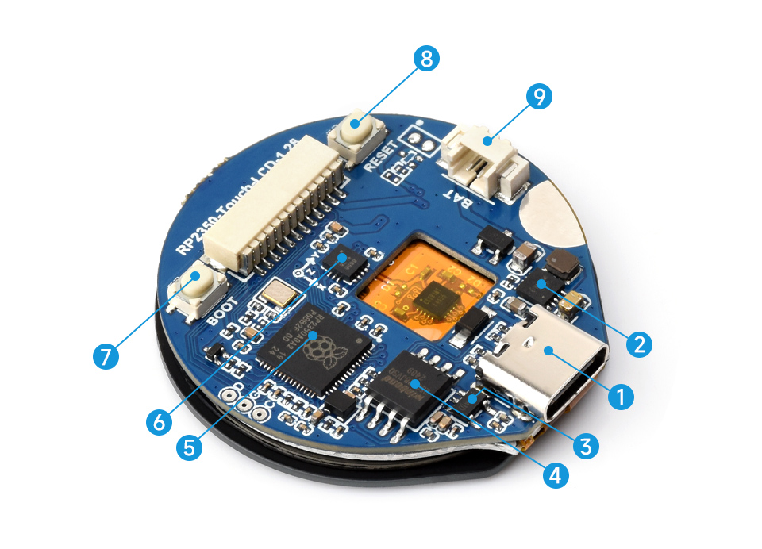
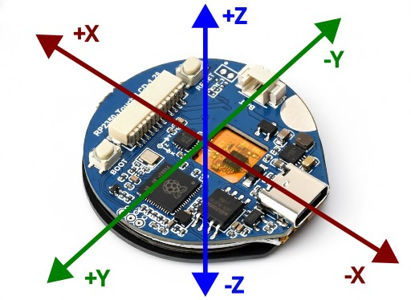

# RP2350 MCU Board, With 1.28inch Round Touch LCD

<http://waveshare.com/wiki/RP2350-Touch-LCD-1.28>

1. USB Type-C connector for program burning, USB 1.1 with device and host support
1. ETA6098 high efficiency Lithium battery recharge manager
1. RT9193-33PB 300mA low dropout, low noise, ultra-fast LDO
1. W25Q128JVSIQ 16MB NOR-Flash
1. RP2350 Dual-core and dual-architecture design, up to 150 MHz operating frequency
1. QMI8658 6-axis IMU includes a 3-axis gyroscope and a 3-axis accelerometer.
1. BOOT button Press it when resetting to enter download mode
1. RESET button
1. MX1.25 battery header MX1.25 2P connector, for 3.7V Lithium battery, supports charging and discharging

## Firmware flashing

* Disconnect from the PC
* Connect while holding down the `BOOT` button
* Release the `BOOT` button, `RP2350` should appear as a USB device
* Copy `WAVESHARE-RP2350-TOUCH-LCD-1.28.uf2` to the device
* `RP2350` will then disappear
* Disconnect and reconnect
* **IMPORTANT**: only firmwares with LVGL compiled in would work!

## Programming

* [Reset and Boot Sequence](https://docs.micropython.org/en/latest/reference/reset_boot.html)
* [RP2 Quick Reference](https://docs.micropython.org/en/latest/rp2/quickref.html)

## Accelerometer

This is a [QMI8658](https://components.espressif.com/components/waveshare/qmi8658/versions/1.0.1/readme) 6-axis MEMS sensor, measuring acceleration and angular velocity.

Axes are as follows:

## Sound

I added a simple piezo [BPT-2312H05W](https://www.hestore.hu/prod_10032057.html) via the GPIO header:

* `GND -> piezo-`
* `GPIO 16 -> 100 ohm -> piezo+`

## Battery

The battery I used is an [Akyga AKY0081 / LP573450 980mAh](https://www.hestore.hu/prod_10048166.html). Measured:

* USB rail: 4.24-4.61V
* Battery: 3.28-3.99V

Interestingly, when the battery goes down, the screen will go off first but the CPU keeps running (gyro was working, piezo was making a sound)
